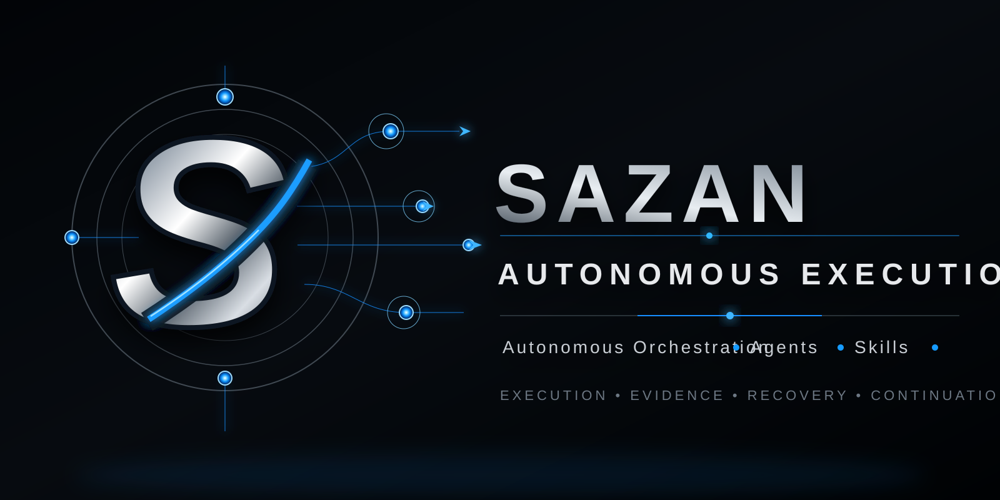

  

# Sazan Autonomous Execution

A platform-independent execution-control skill for AI agents that plans, executes, validates, recovers, documents, and continues until completion or a genuine human decision is required.

## Core principle

Do not stop just because a substep finished. Continue through every safe and available next action.

## State machine

`INTAKE → PLAN → EXECUTE → VERIFY → RECOVER → CONTINUE → COMPLETE`

Use `ESCALATE` only for genuine human-required blockers.

## GitHub MCP provider

The execution layer now includes a pinned, fail-closed launcher for the official GitHub MCP Server. Its baseline profile is read-only, enables lockdown mode, exposes only the approved repository/PR/issue/actions/security toolsets, and takes credentials only from the runtime environment.

See `docs/GITHUB-MCP-INTEGRATION.md`.

## Playwright MCP provider

The browser layer includes a pinned `@playwright/mcp@0.0.83` observe-mode provider behind a SAZAN stdio guard proxy. The proxy filters the upstream tool inventory, blocks action-capable tools by default, disables WebMCP and optional high-risk capability sets, uses isolated browser state, and denies local/private network targets unless a test-only runtime override is explicitly enabled.

See `docs/PLAYWRIGHT-MCP-INTEGRATION.md`.

## Context7 MCP provider

The documentation layer includes a pinned `@upstash/context7-mcp@4.1.1` provider behind a SAZAN read-only stdio guard. The guard exposes exactly `resolve-library-id` and `query-docs`, sanitizes the child-process environment, keeps the optional API key out of command arguments, disables local OpenTelemetry instrumentation, and blocks common credential/key patterns before a documentation query leaves SAZAN.

See `docs/CONTEXT7-MCP-INTEGRATION.md`.

## Repository structure

- `assets/branding/` — repository-specific Sazan child-brand assets
- `SKILL.md` — reusable execution policy
- `AGENTS.md` — repository-level agent instructions
- `agents/repo-skill-steward/mcp/` — governed MCP execution profiles and launchers
- `docs/execution-model.md` — state machine and control flow
- `docs/stop-conditions.md` — precise escalation rules
- `docs/evidence-and-validation.md` — evidence gates and completion semantics
- `templates/task-state.md` — persistent task-state template
- `templates/final-report.md` — completion report template

## Status

Active pre-1.0 development. Deterministic repository-intelligence and release-readiness gates are implemented and exercised in CI. Live provider runtime proofs remain explicit release blockers until their credentialed workflows pass. No production-ready claim is made without environment-specific validation evidence.

## Open-source maintenance

This repository is licensed under the MIT License. See [CONTRIBUTING.md](CONTRIBUTING.md), [SECURITY.md](SECURITY.md), [MAINTAINERS.md](MAINTAINERS.md), and [docs/RELEASE_CHECKLIST.md](docs/RELEASE_CHECKLIST.md) before contributing or preparing a release.

Repository activity is evidence-driven: tests, issues, pull requests, runtime proofs, and releases must reflect real work. Failed or credential-blocked runtime proofs remain visible blockers instead of being converted into success claims.
